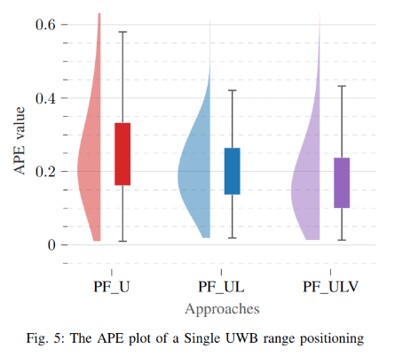
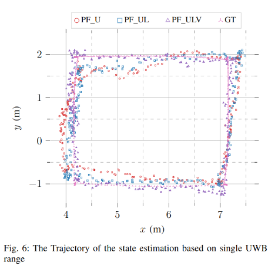
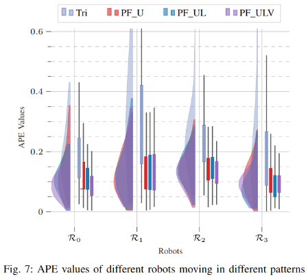
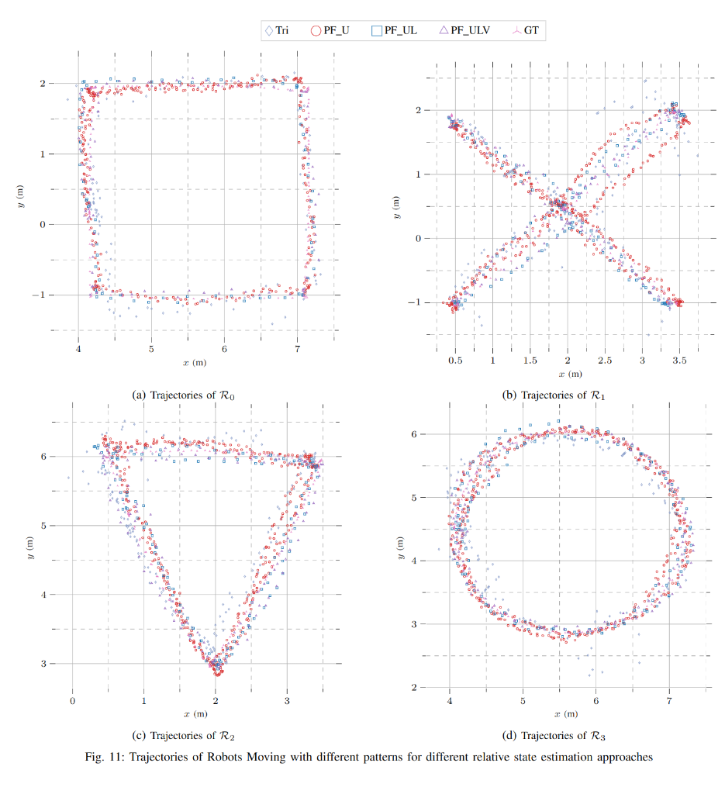

# Fusing Odometry, UWB Ranging, and Spatial Detections for Relative Multi-Robot Localization

This repo contains code for refine the Ultral-Wideband ranging with the detected spatial information of an object seen by multiple robots at the same time.

If you find the code or data in this repository useful in your research, [the related paper is available in our website](https://tiers.utu.fi/paper/xianjia2023loosely):
  ```
  @article{xianjia2023loosely, 
      title="Loosely Coupled Odometry, {UWB} Ranging, and Cooperative Spatial Detection for Relative Monte-Carlo Multi-Robot Localization", 
      author="Xianjia Yu and  Paola Torrico Mor\'on and  Sahar Salimpour and Jorge {Pe\~na Queralta} and Tomi Westerlund", 
      journal="arXiv", 
      year="2023"
  }
  ```

## Installation 

1. ROS 2 galactic \
Install ros2 galactic following the instruction [here](https://docs.ros.org/en/galactic/Installation/Ubuntu-Install-Debians.html)

2. Eclipse Zenoh \
Add Eclipse Zenoh private repository to the sources list:

       
        echo "deb [trusted=yes] https://download.eclipse.org/zenoh/debian-repo/ /" | sudo tee -a /etc/apt/sources.list > /dev/null
        sudo apt update
        

    Then either: \
     install the plugin with: `sudo apt install zenoh-plugin-dds`.\
     install the standalone executable with:  `sudo apt install zenoh-bridge-dds`.
3. depthai_ros_msgs

        sudo apt install ros-foxy-depthai-ros-msgs
4. Others

        pip install numpy matplotlib pfilter


<!-- ## Data
### Recorded ros2 bags from 2022/09/23. 

2robots_move_one_static: turtlebot4 and turtlebot1 was moving a circle while turltebot3 static. 

3robots_moving_circles: turltebot1, turltebot3, and turtlebot4 were all moving a circle at the same time and observed the chair from time to time.

### Recorded ros2 bags from 2022/09/28.
3robots_moving_1_static_01: turtlebot1, turtlebot3, and turtlebot4 were moving in a circle while turtlebot 5 static. 2 chairs were added during the recording as objects.

### Recorded ros2 bags from 2022/10/04.
4robots_data_01: turtlebot1, turtlebot3, and turtlebot4 were moving in different circles while turtlebot 5 static. 2 chairs were added during the recording as objects. 

cali_4robots_data_01: The odometry calibrated version based on the above one.

Topics can be seen as follows.
```
# spatial detection results. turtle05 can always see one object.
/turtle01/color/yolov4_Spatial_detections
/turtle03/color/yolov4_Spatial_detections
/turtle04/color/yolov4_Spatial_detections
/turtle05/color/yolov4_Spatial_detections
# odometry data
/turtle01/odom
/turtle03/odom
/turtle04/odom
/turtle05/odom
# uwb range data
/uwb/tof/n_3/n_4/distance
/uwb/tof/n_3/n_5/distance
/uwb/tof/n_3/n_7/distance
/uwb/tof/n_4/n_5/distance
/uwb/tof/n_4/n_7/distance
/uwb/tof/n_7/n_5/distance
# optitrack position data
/vrpn_client_node/chair2/pose
/vrpn_client_node/chair_final/pose
/vrpn_client_node/turtlebot1_cap/pose
/vrpn_client_node/turtlebot3_cap/pose
/vrpn_client_node/turtlebot4_cap/pose
/vrpn_client_node/turtlebot5_cap/pose
``` -->

## How to run

Please see below for instructions on running the proposed algorithms with predefined data.

### Proposed Particle Filter Approach

Currently, if you only want to run one round of each filter.
For multiple robots, 
```
python3 pf_ros2_multi_ulv.py --fuse_group 0 --with_model False 
```
Arguments meaning(currently not used):
```
--fuse_group 
  0: only uwb
  1: uwb and vision

--with_model False  # enable the LSTM ranging error estimation
```

For single UWB range.
```
pf_ros2_single_ulv.py --fuse_group 0 --with_model False
```

After running this code, the images of particles will be saved in 
```
../images/
```
The groudtruth and estimated relative pose will be in 
```
../pos/
```
The errors will be in 
```
../errors/
```

### Triangulation
```
python3 tri_ros2_ul.py --with_model False
```
<!-- #### Run In a Loop
Run a script that can generate all the results of all rounds of different fusing group.
```
python script/run_filter_v1.1_clean_multi.py
``` -->


<!-- ### Calibration
#### odom 
The odom has translations compared with its global position. So we need to calibrate it and republish the topics to:

```
/cali/turtle01/odom
/cali/turtle03/odom
/cali/turtle04/odom
/cali/turtle05/odom
```
currently mainly run the code in 
```
python script/cali_odom.py
```
#### uwb

currently mainly run the following. First run 
```
python script/bias_estimation.py
```
while running a rosbag. It will then save the information in

```
/data/bias_estimation.npz
```
Then run the script

```
python script/plot_bias.py
```
It will save the images in

```
/images/bias_estimation.png
```


#### stereo camera
<!-- FIXME: bias are big, needs to check the code -->
<!-- currently mainly run the code in 
```
script/camera_opti.py
``` --> 

## Results visualization
currently mainly run the code in 
```
script/errors/
```
### Single UWB range
APE             |  Trajectory         
:-------------------------:|:-------------------------: 
  |  


### Multiple UWB ranges
#### APE                 
  

#### Trajectories



### Single UWB range
APE             |  Trajectory         
:-------------------------:|:-------------------------: 
  |  


### Multiple UWB ranges

#### APE                 
  

#### Trajectories


## Acknowledgement
This research work is supported by the Academy of Finland’s AeroPolis project (Grant No. 348480), and by the R3Swarms project funded by the Secure Systems Research Center (SSRC), Technology Innovation Institute (TII).


## To Do List
- [ ] Change the results in Readme
- [ ] Add the paper abstract and Arkiv link
- [ ] A None ROS version
